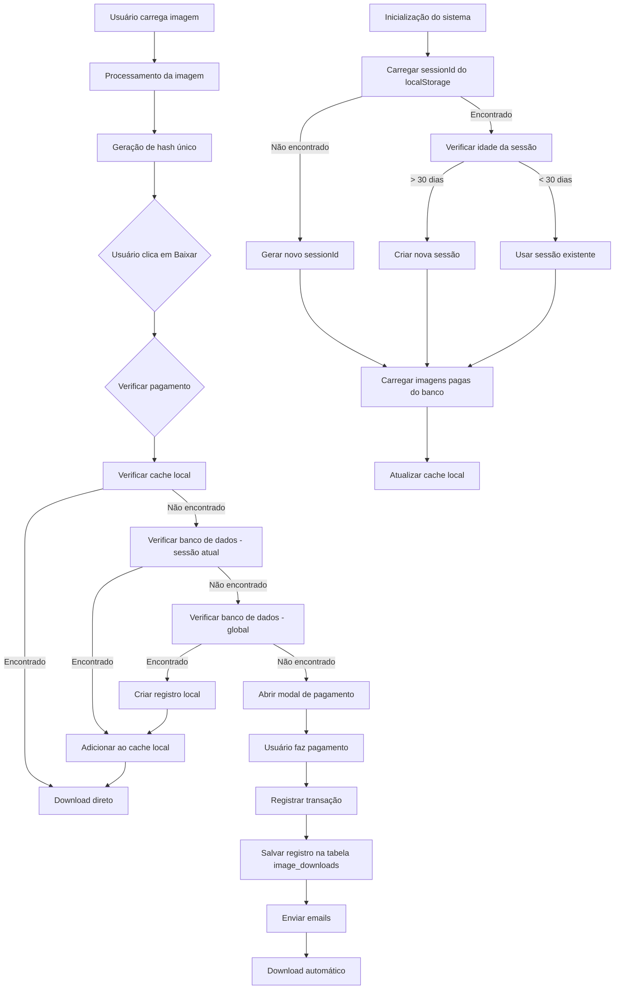

# Documentação da Solução do Sistema de Pagamento

## Visão Geral

O sistema de pagamento do Reduza Pixel foi aprimorado para garantir:

1. **Persistência de pagamentos**: Imagens pagas permanecem acessíveis mesmo após fechar o navegador
2. **Verificação robusta**: Múltiplas camadas de verificação para garantir acesso apenas a imagens pagas
3. **Experiência de usuário consistente**: Download automático após pagamento bem-sucedido
4. **Notificações por email**: Envio de confirmações para usuários e administradores

## Arquitetura do Sistema

### 1. Identificação de Sessão e Imagens

- **Hash único para imagens**: Cada imagem processada recebe um hash baseado em:

  ```typescript
  const content = `${imageFile.file.name}_${imageFile.processedSize}_${imageFile.processedDimensions?.width}x${imageFile.processedDimensions?.height}`;
  return btoa(content).replace(/[^a-zA-Z0-9]/g, "");
  ```

- **Sessão persistente**: O sistema mantém um `sessionId` persistente no `localStorage`:
  ```typescript
  const savedSessionId = localStorage.getItem("reduza_pixel_session_id");
  if (savedSessionId) {
    return savedSessionId;
  } else {
    const newSessionId = generateSessionId();
    localStorage.setItem("reduza_pixel_session_id", newSessionId);
    return newSessionId;
  }
  ```

### 2. Verificação de Pagamento em Camadas

O sistema implementa uma verificação em três camadas para determinar se uma imagem já foi paga:

1. **Cache local**: Verificação rápida no estado React e `localStorage`
2. **Banco de dados - sessão atual**: Verificação específica para a sessão do usuário
3. **Banco de dados - global**: Verificação em todas as sessões (permite reutilização de pagamentos)

```typescript
// 1. Verificação no cache local
if (paidImages.has(imageHash)) {
  return true;
}

// 2. Verificação no banco para sessão atual
const { data: sessionData } = await supabase
  .from("image_downloads")
  .select("id")
  .eq("image_hash", imageHash)
  .eq("session_id", sessionId)
  .not("transaction_id", "is", null)
  .limit(1);

if (sessionData && sessionData.length > 0) {
  savePaidImages([imageHash]);
  return true;
}

// 3. Verificação global no banco de dados
const { data: globalData } = await supabase
  .from("image_downloads")
  .select("id")
  .eq("image_hash", imageHash)
  .not("transaction_id", "is", null)
  .limit(1);

if (globalData && globalData.length > 0) {
  // Criar registro local para futuras verificações
  // ...
  savePaidImages([imageHash]);
  return true;
}

return false;
```

### 3. Fluxo de Pagamento

1. **Usuário clica em "Baixar"**
2. **Sistema verifica se imagem já foi paga**:
   - Se sim, download direto
   - Se não, abre modal de pagamento
3. **Usuário completa pagamento**:
   - Registra transação no banco
   - Salva registro na tabela `image_downloads`
   - Envia emails de confirmação
   - Inicia download automático

### 4. Persistência de Dados

- **Tabela `transactions`**: Armazena detalhes da transação M-Pesa
- **Tabela `image_downloads`**: Relaciona imagens pagas com transações
- **Cache local**: Armazena hashes de imagens pagas no `localStorage`

### 5. Limpeza de Sessões Antigas

O sistema implementa uma verificação de idade de sessão para evitar acúmulo de dados antigos:

```typescript
const thirtyDaysAgo = new Date();
thirtyDaysAgo.setDate(thirtyDaysAgo.getDate() - 30);

const sessionCreationString = localStorage.getItem(
  "reduza_pixel_session_created_at"
);
if (sessionCreationString) {
  const sessionCreation = new Date(sessionCreationString);
  if (sessionCreation < thirtyDaysAgo) {
    // Sessão atual expirada, criar nova
    const newSessionId = generateSessionId();
    localStorage.setItem("reduza_pixel_session_id", newSessionId);
    localStorage.setItem(
      "reduza_pixel_session_created_at",
      new Date().toISOString()
    );
    window.location.reload();
  }
}
```

## Servidor de Email

O sistema utiliza um servidor Node.js com Express e Nodemailer para enviar emails de confirmação:

- **Configuração SMTP**: Zoho Mail (smtp.zoho.com)
- **Tipos de email**:
  - **Confirmação para cliente**: Recibo de pagamento (opcional)
  - **Notificação para administrador**: Alerta de nova transação

## Diagrama de Fluxo



## Principais Melhorias Implementadas

1. **Persistência de sessão**: O `sessionId` é armazenado no `localStorage` para persistir entre recarregamentos de página
2. **Verificação global de imagens pagas**: Permite que imagens pagas em uma sessão sejam reconhecidas em outras sessões
3. **Limpeza automática de sessões**: Sessões com mais de 30 dias são automaticamente renovadas
4. **Logs detalhados**: Sistema de logs aprimorado para facilitar depuração
5. **Tratamento de erros robusto**: Todas as operações de banco de dados possuem tratamento de erros adequado
6. **Download automático após pagamento**: Fluxo contínuo para melhor experiência do usuário
7. **Notificações por email**: Confirmações enviadas para usuários e administradores

## Considerações Finais

O sistema agora oferece uma experiência consistente e confiável para os usuários, garantindo que imagens pagas permaneçam acessíveis mesmo após fechar o navegador ou mudar de dispositivo. A implementação de múltiplas camadas de verificação e persistência de dados torna o sistema robusto contra falhas e interrupções.

